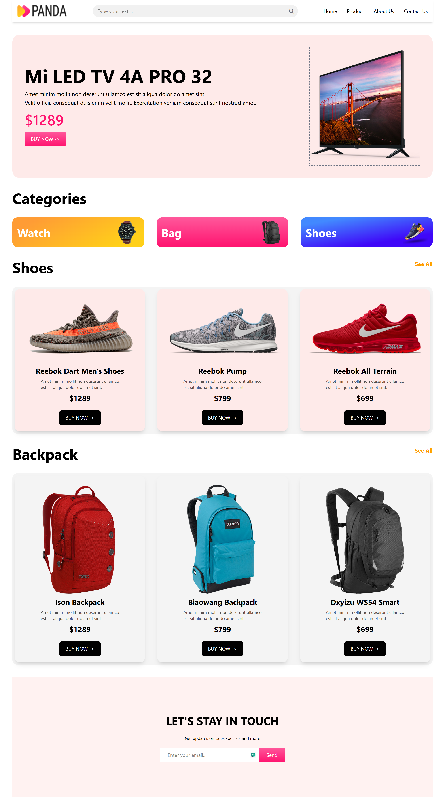

# Panda - E-commerce Landing Page

## 📸 Screenshots



**Live Demo:** [Panda Live Site](https://ahammad204.github.io/Panda/)

---

## 📖 Overview
**Panda** is a modern and responsive e-commerce landing page designed using **HTML**, **Tailwind CSS**, and **FontAwesome icons**.  
This project highlights a clean, minimalistic UI showcasing product categories like **Watches, Bags, and Shoes**, along with dedicated sections for featured products and a **"Stay in Touch"** email subscription feature.

---

## ✨ Features
- **Responsive Design** – Optimized for mobile, tablet, and desktop screens.
- **Modern UI/UX** – Designed using Tailwind CSS for a clean and modern look.
- **Dynamic Navigation** – Includes both desktop and mobile-friendly navigation menus.
- **Category Showcase** – Beautiful cards for Watches, Bags, and Shoes.
- **Featured Products** – Highlighted sections with product images, descriptions, and prices.
- **Email Subscription** – "Stay in Touch" section with a subscription form.
- **FontAwesome Icons** – Enhanced design with scalable vector icons.
- **Fast & Lightweight** – No heavy frameworks, ensuring quick loading.

---

## 🖼 Sections
- **Navbar** – Responsive navigation menu with search functionality.
- **Hero Banner** – A featured product highlight with a call-to-action button.
- **Categories** – Watch, Bag, and Shoe cards with custom background colors.
- **Products** – Featured Shoes and Backpack product grids with "Buy Now" buttons.
- **Contact Section** – Email subscription to stay updated on sales and promotions.

---

## 🛠️ Technologies Used
- **HTML5** – Markup structure of the project.
- **Tailwind CSS (via CDN)** – Styling and responsive design.
- **FontAwesome** – Icons used in navigation and UI.
- **Vanilla JS** (for mobile menu toggle).

---

## 📂 Project Structure
```

Panda/
├── index.html        # Main HTML file
├── style.css         # Custom styling (if any additional)
├── images/           # Images for products, categories, and logo
│   ├── logo.png
│   ├── banner-images/
│   ├── categories/
│   ├── shoes/
│   └── bags/
└── index.js          # JS file for interactivity (e.g., mobile menu)

````

---

## 🚀 How to Run Locally
1. **Clone the repository**:
   ```bash
   git clone https://github.com/ahammad204/Panda.git
````

2. **Open the project folder**:

   ```bash
   cd Panda
   ```
3. **Run the project**:

   * Simply open `index.html` in your browser.


## 📧 Contact

If you have any feedback or suggestions, feel free to reach out:

* **Author:** Kazi Ahammad Ullah
* **GitHub:** [ahammad204](https://github.com/ahammad204)
* **Live Site:** [Panda](https://ahammad204.github.io/Panda/)

### ⭐ **Don't forget to star this repository if you like this project!**

